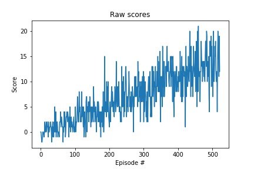

# Udacity Deep Reinforcement Learning 
# Navigation Project report

Ben Hosken ben@neuronwave.com

## Overview and Implementation

The goal of this project was to train an agent to navigate a simple world environment, collecting yellow bananas while avoiding blue bananas. 

The project environment is built in Unity and is a version of the Banana Collector, customised for the Udactity Deep Reinforcement Learning nanodegree. The task is episodic and there are 37 different state space dimensions with 4 different possible actions. Rewards of +1 are accumulated when a yellow banana is collected and -1 when a blue banana is picked up. There are no rewards or penalties for moving. The task is considered solved when a score of 13 or more is achieved over 100 consecutive episodes. 


The model used successfully solved the problem after 422 episodes, which was exceptionally surprising given the extended target in the project was to have it acheive this with 1300 episodes. 


## Learning algorithm

The solution implemented is a simple Deep Q-Learning (DQN) algorithm based on the classic Deep Mind paper from Nature. Hassabis et al. Human-level control through deep reinforcement learning. Nature February 2015. It included experience replay and fixed Q targets, both of which are considered standard in a DQN.


### Model architecture

A range of neural models were tried exploring wide, deep and shallow configurations. Overall, the simpler models performed as well or better than deeper ones and wide models performed worse than narrow ones. All models started with a 37 x 1 input vector from the environment, constructed two or more fully connected hidden layers and ended with a fully connected layer outputing 4 outputs, one for each action. 
 
The final solution used two hidden layers of 64 and 128 neurons respectively. 

```
QNetwork(
  (fc1): Linear(in_features=37, out_features=64, bias=True)
  (fc2): Linear(in_features=64, out_features=128, bias=True)
  (out): Linear(in_features=128, out_features=4, bias=True)
)
```

The following configurations were also tested

64 64 64 32 - Solved in 395 episodes
64 64 - Solved in 426 episodes
128 64 - Solved in 482 episodes
128 256 - Did not solve in under 1000 episodes

The interesting observation from this is that narrow and shallow networks worked best and the wide networks failed to converge.

### Hyper parameters

All hyper parameters were fixed during the testing. We had expected to need to "play" with these to optimise the solution, however, the training results were such that this was not needed. 

* Replay buffer size 100,000 
* Discount factor 0.99 (gamma)
* Soft update factor 0.001 (tau)
* Learning rate 0.0004 (alpha)
* Network update step interval 4

## Results

I was suprised by the results, specifically, how easy it was to achieve the goal score with almost no modifications. The consistent solving of the problem when training, and the low number of episodes required, was not expected. 

We had expected to spend significant time tuning hyperparams and running on GPU instances, however, our MacBook Pro CPU completed the training in under 5 minutes.




```
Episode 100	Average Score: 1.02
Episode 200	Average Score: 3.88
Episode 300	Average Score: 6.90
Episode 400	Average Score: 9.46
Episode 500	Average Score: 12.33
Episode 522	Average Score: 13.02
Environment solved in 422 episodes!	Average Score: 13.02
```

## Ideas for future work

Overall, this environment was easily solved using a simple DQN DNN model with a very shallow configuration of layers. 

I believe that implementation of Dueling DQNs or other enhancemnets to the standrad implementation would be overkill. 

Rather than extend the DQN itself, we would be very interested in exploring how bayesian sampling could be used (Thompson Sampling) in the policy evaluation step rather than using a Epsilon Greedy approach. 


